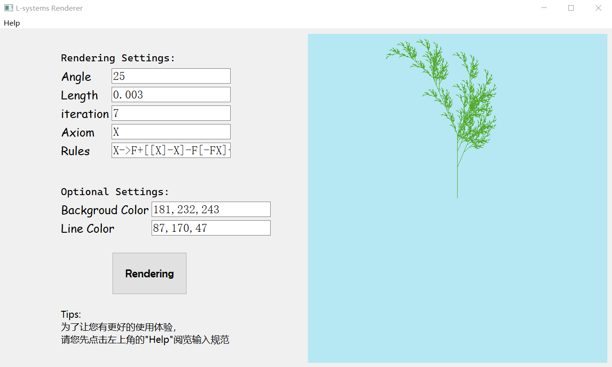
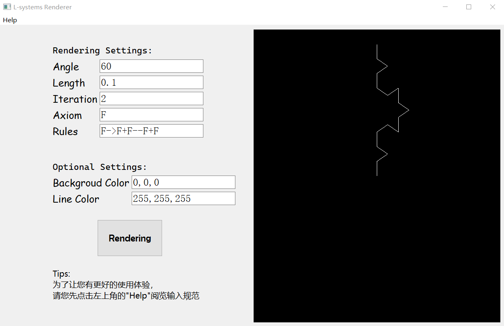
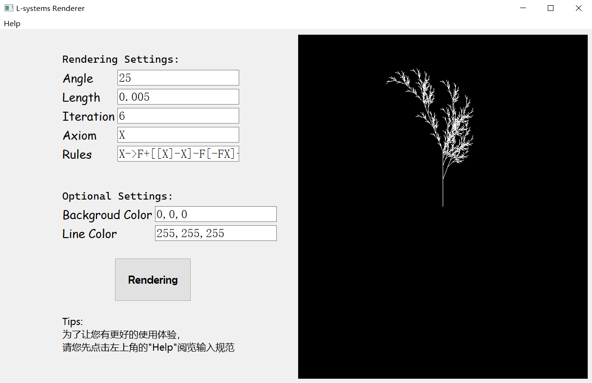

# L-system渲染器

## 简介

​		这是一个用于生成和可视化L-system（Lindenmayer-systems）的项目。L-system，是由荷兰乌特勒支大学的生物学和植物学家，匈牙利裔的 Aristid Lindenmayer 于 1968 年提出的有关生长发展中的细胞交互作用的数学模型，被广泛应用于植物生长过程的研究和建模，也常用于模拟各种生物体的形态。L-system 是一系列不同形式的语法规则，它的自然递归规则产生自相似性，也能用于生成自相似的分形，是一种形态发生算法。

## 文件说明

bin：存放.exe可执行文件。

src：存放源代码文件。

## 运行环境

操作系统：win10

运行、编码软件：Visual Studio 2022

C++标准：ISO C++14

## 功能介绍

​		本项目的核心功能是根据用户输入的参数（如迭代次数、公理、转换规则、角度、长度等）生成和渲染L-system。用户可以在图形界面中方便地输入参数，生成的L-system将会实时渲染到屏幕上。



## 技术栈

​		本项目主要使用C++编写，同时也利用了Qt库实现图形界面，使用OpenGL进行L-system的渲染。

- **C++**：本项目的核心算法和逻辑都是使用C++实现的。C++是一种广泛使用的编程语言，特别适合进行系统级和性能敏感的编程。

- **Qt**：本项目使用Qt库实现图形界面。Qt是一个跨平台的C++库，它提供了一套完整的图形界面开发框架，包括窗口、控件、事件处理等功能。

- **OpenGL**：本项目使用OpenGL进行L-系统的渲染。OpenGL是一种用于渲染2D和3D图形的跨语言、跨平台的API。

## 知识运用

​		在本项目中，我运用了一些计算机图形学、数据结构与算法等计算机专业知识，例如stack、图形编程、分形理论等。

​		在渲染部分，我采用了OpenGL的着色器进行绘图。Qt提供了QOpenGLFunctions类和QOpenGLBuffer、QOpenGLShaderProgram等工具来帮助我们更容易地使用现代OpenGL。我也用到了Qt的一些特性，例如信号和槽，以及布局管理。

## 使用手册

​		如果您只需要使用，不需要更改程序源代码，您只需点击bin文件夹中的L-systems.exe可执行文件，运行程序后，您可以在图形界面中输入参数，然后点击“Rendering”按钮，就可以看到生成的L-system。您还可以在可选设置中设置背景颜色和绘制图形的颜色。

​		如果您需要更改程序源代码，您先需要安装Qt库和OpenGL。然后，您可以通过Visual Studio打开并构建项目。

## 测试用例

```C++
// 1、Koch snowflake（科赫曲线）
Angle：60
Length：0.1
Iteration：2
Axiom：F
Rules：F->F+F--F+F
```

Output：




```C++
// 2、Fractal plant
Angle：25
Length：0.005
Iteration：6
Axiom：X
Rules：X->F+[[X]-X]-F[-FX]+X,F->FF
```

Output：



## 其他信息

作者：VittorioDong

版本：1.0.0

时间：JUL 26 2023
