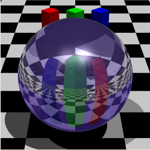
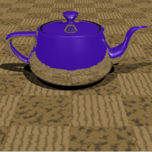
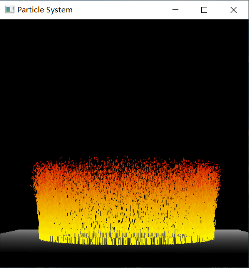

## Introduction

I'm pleased to share my successfully completed programming assignments from the "Intro to Computer Graphics" (MIT 6.837) course. This course offered an in-depth understanding of the core principles of computer graphics, covering topics from the graphical pipeline to complex algorithms such as Ray Tracing.

This project encompasses a series of assignments each focusing on a different aspect of computer graphics like Transformations, Hierarchical Modeling, Camera, Lights and Materials, Ray Casting and Ray Tracing. Each assignment presented its unique challenges, giving me the chance to dive deep into the subject.

## Repository Structure

In this repository, you will find each assignment organized in their respective directories. Each directory contains all the necessary source files and resources.

## Requirements & Setup

To run this project, you'll need the following:

1. A compiler supporting C++11
2. OpenGL library
3. FreeGLUT library

## Rendered Images

Below are some rendered images from the project:

## Conclusion

The project stands as a testament to my journey in understanding and implementing computer graphics principles. I encourage exploration and hope my work can serve as a beneficial resource to fellow graphics enthusiasts and learners.

I highly recommend the "Intro to Computer Graphics" (MIT 6.837) course to anyone looking to further their knowledge in computer graphics. My gratitude goes out to MIT and the course instructors for making such an insightful resource available.

